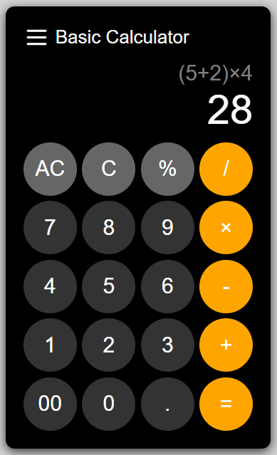

# Calculator

This is a simple calculator web application that allows users to perform basic arithmetic operations. The calculator supports addition, subtraction, multiplication, division, and percentage calculations.

## Screenshot

## Features

- Basic arithmetic operations: addition, subtraction, multiplication, division, and percentage.
- Keyboard support for input.
- Clear (C) and All Clear (AC) buttons to manage input.
- Responsive design.

### Files

- **index.html**: The main HTML file that contains the structure of the calculator.
- **script.js**: The JavaScript file that handles the calculator's functionality.
- **styles.css**: The CSS file that styles the calculator.

## Usage

1. Clone the repository or download the project files.
2. Open `index.html` in a web browser.

## License

This project is licensed under the MIT License. See the LICENSE file for details.